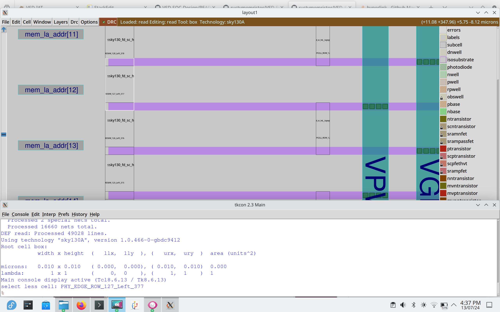

# VSD-SOC-Design
Documentation for the NASSCOM-VSD-SOC Program. This project does not use the default image, and hence some differences in commands may be present. These will be mentioned when used.

## Documentation
[Go to Lab 1](#lab-1)

[Go to Lab 2](#lab-2)

[Go to Lab 3](#lab-3)

[Go to Lab 4](#lab-4)

[Go to Lab 5](#lab-5)

## Lab 1 
Tasks for lab 1 include
1. Learning basic directory structure in openlane
2. Invoking the openlane flow interactively
3. Running synthesis
4. Checking Synthesis Logs for instantiations, cell count etc. 
5. Calculating Flop Ratio

Invoking the openlane interactive flow and exploring the picorv32a directory structure.


Viewing main config.tcl file


Preparing the picorv32a design.
```
prep -design picorv32a
```


Viewing the output of prep design command. This is created inside the runs folder created in the above step. In the current openlane version there are 3 files, this is the nominal version hence called merged.nom.lef


Viewing config.tcl created by starting the run.


Running Synthesis.
```
run_synthesis
```


Viewing Synthesis Log. These are created under the logs/synthesis folder inside the current run.


Viewing Synthesis Log.


Viewing Synthesis Log.


Viewing Synthesis STA Log.

To calculate flop ratio, there is a simple formula
```math
Flop\;Ratio = \frac{Total\;Number\;of\;D\;Flip-flops}{Total\;Number\;of\;cells}
```
```math
Flop\;Ratio = \frac{1513}{16558} = 0.091375770021
```
```math
\%Flop\;Ratio = 09.1375770021
```

## Lab 2
Tasks for lab 2 include
1.  Running the floorplan.
2.  Calculating die area.
3.  Examining the produced def file using MAGIC.
4. Running placement.
5. Viewing the def file post placement.


Running the floorplan and initial floorplan log.


Initial IO placement (In this case it is equidistant randomised)


Initial Tapcell placement.


Initial Power Distribution Network (PDN).


Created DEF file. The def file created has a priority order of 
```
1. specific pdk instances
2. config.tcl file held locally
3. configuration/floorplan.tcl
```
It shows the area in microns, in the format ```DIE AREA (x0,y0) (x1, y1)``` We can calculate the die area by

$$
Die Area = 692,760\\mu m \times 703,480\\mu m = 487,263,728,000\\mu m^2
$$


This is the command to view the DEF file created in magic. In my case a custom alias called magicsky is used which sets my graphics to cairo and sets technology to sky130A. This command is executed inside the generated floorplan def folder, and hence does not use the full pathnames.
```
magicsky lef read ../../tmp/merged.nom.lef def read picorv32a.def &
```


View of picorv32a in magic post floorplan



Closer look at power distribution lines and cells used.


Closer look at the floorplan.       


Trying to change the metal layers for horizontal and vertical IO. Done by varying the config.tcl. (Spaces were added between set and : in later runs)


Flow failed due to incorrect env variable (documentation shows deprecated)
Default is now layer 3 and 4 according to documents. Also called VLAYER and HLAYER now.


Running placement.


Post placement DEF file in magic. This is run inside the placement folder in the results directory.
```
magicsky lef read ../../tmp/merged.nom.lef def read picorv32a.def &
```


Closer look at the placed cells.


Decaps present near IO.


Another view of the placement.

## Lab 3 
Tasks for lab 3 include
1. Characterizing the inverter cell.
2. Spice deck creation.
3. Viewing Layers in the inverter LEF file.
4. Modifying parameters to correct DRC, and verify via documentation.


Cloning the github repository containing the Inverter cell
```
git clone https://github.com/nickson-jose/vsdstdcelldesign.git
```


Viewing the inverter in Magic using the command
```
magicsky sky130_inv.mag
```


Verifying ports


Extracting first to the ext format, setting ext2spice parameters, then generating a spice file.
```
extract all                                     *generates file with .ext*
```
```
ext2spice cthresh 0 rthresh 0                   *no file generated*
```
```
ext2spice                                       *.spice file generated*
```


vsdstdcelldesign folder after above execution of extract all command


folder after execution of ext2spice


Viewing initial spice file generated by command ext2spice in magic. 


Changing parameters to match our PMOS and NMOS, and adding evaluation parameters with nodes.


running ngspice with sky130_inv.spice as file.

```
ngspice sky130_inv.spice
```


Plotting output y against Time.


Zoomed in value for 
Rise Transition (20% of maximum value to 80% of maximum value)   

```
x0 = 2.15506e-09, y0 = 0.659655

x0 = 2.19803e-09, y0 = 2.63931  

Rise Transition Time = 0.04297ns
```


Zoomed in value for 
Fall Transition (80% of maximum value to 20% of maximum value)
```
x0 = 8.04014e-09, y0 = 2.63929

x0 = 8.06728e-09, y0 = 0.659661  

Fall Transition Time = 0.02714ns
```


Zoomed in value for
Cell Rise propagation Delay
```
x0 = 6.15e-09, y0 = 1.65017

x0 = 6.18168e-09, y0 = 1.65017

Cell Rise Propagation Delay = 0.03168ns
```


Zoomed in value for

Cell Fall propagation Delay
```
x0 = 8.05332e-09, y0 = 1.64999

x0 = 8.05003e-09, y0 = 1.65  

Cell Fall Propagation Delay = 0.00329ns
```

Downloading magic drc Violating files.


Viewing Metal 3 layers.


Using a command to display cause of DRC violation. First select by hovering the cursor over the cell in question, then pressing 's' in the TKcon type:
```
drc why
```


Opening the Poly file and viewing the layer and drc violation.


Initial SKY130.tech file poly.9 parameters.


Modified Parameters.


Modified Parameters.


Checking to see if DRC is violated for all test cases.


Opening nwell.mag and viewing the CIF.


Viewing the implementation of templayers which are the formations present only for the construction of the final layers.


Initial N well parameters for DRC violations.


Modified parameters for proper DRC violation in N well.


Violation vs fixed implementation of N Well DRC.

## Lab 4 
Tasks for lab 4 include
1. Adding our previously characterized inverter cell in our layout.
2. Fixing any negative slack.
3. Performing Clock Tree Synthesis (CTS)
4. Finding final hold and sample slack as well as skew.

